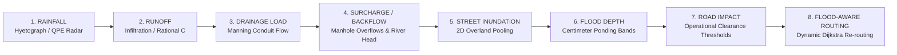

# VARUNETRA: Urban Flood Nowcasting System (Drainage and Rainfall Coupling)
**Problem Statement ID:** SIH26085 | **Theme:** Disaster Management | **Category:** Software  
**Sponsoring Organization:** Ministry of Earth Sciences (MoES), Government of India  
**Pilot Basin:** SYNTHETIC PILOT GEOGRAPHY (Patna Urban Basin Demonstration)

---

## 1. Executive Summary & SIH26085 Core Alignment

**VARUNETRA** is an urban flood intelligence and emergency command platform designed specifically for **SIH26085: Urban Flood Nowcasting System (Drainage and Rainfall Coupling)**. 

Unlike conventional weather apps that treat urban flooding as disconnected 2D rainfall puddles, VARUNETRA couples **short-burst convective precipitation hyetographs** with **subsurface stormwater conduit hydraulics (Manning flow)** to predict manhole surcharge, river outfall backwater, and street-level inundation depths.

### The Primary Physical User Journey:
$$\mathbf{RAINFALL} \longrightarrow \mathbf{RUNOFF} \longrightarrow \mathbf{DRAINAGE\ LOAD} \longrightarrow \mathbf{SURCHARGE\ /\ BACKFLOW} \longrightarrow \mathbf{STREET\ INUNDATION} \longrightarrow \mathbf{FLOOD\ DEPTH} \longrightarrow \mathbf{ROAD\ IMPACT} \longrightarrow \mathbf{FLOOD-AWARE\ ROUTING}$$



---

## 2. Core SIH26085 Features vs. Operational Extensions

To preserve total technical clarity, the system strictly separates core hackathon scientific requirements from mission operational extensions:

### CORE SIH26085 FEATURES (Physical & Mathematical Scope)
1. **Coupled Rainfall & Drainage Hydrodynamics**:
   - Subcatchment surface runoff calculated via Rational Infiltration formulation ($Q = \frac{C \cdot I \cdot A}{360}$).
   - Subsurface gravity conduit conveyance solved with Manning's open/full-flow equation ($Q = \frac{1}{n} A R^{2/3} S^{1/2} \sqrt{1 - \beta}$).
2. **Hydraulic Surcharge & River Outfall Backflow**:
   - Piezometric hydraulic grade line (HGL) tracked at every manhole node relative to ground rim elevation.
   - Ganges River outfall backwater head ($H_{\text{river}} = 49.85\text{ m MSL}$) modeled to detect reverse hydraulic gradients that prevent gravity discharge.
3. **0–3 Hour High-Resolution Flood Nowcasting**:
   - Scrubbable 15-minute intervals: `NOW`, `+15`, `+30`, `+45`, `+60`, `+90`, `+120`, `+150`, `+180 MIN`.
   - Real-time updates of rainfall rate, accumulated rain, surcharged manholes, active inundation area ($\text{km}^2$), and restricted corridors.
4. **Machine Learning Hydro-Surrogate Model**:
   - Accelerated inference ($0.016\text{ ms}$) using `HistGradientBoosting` trained on 3,787 spatial-temporal simulation samples.
   - Quantile prediction intervals ($10\% - 90\%$) providing depth bounds and uncertainty metrics rather than false millimeter precision.
5. **Explainable AI (XAI) & 7 Causal Risk Factors**:
   - Local TreeSHAP attribution answering *"Why is this location at risk?"* across:
     - Rainfall accumulation (3h)
     - Forecast rainfall (Nowcast)
     - Drainage hydraulic pressure
     - Ground invert elevation (DEM)
     - Urban impervious surface fraction
     - Conduit debris/silt blockage factor
     - Historical lowland bowl tendency
   - Strict distinction between statistical surrogate attribution and physical hydraulic certainty.
6. **Dynamic Flood-Aware Routing Engine**:
   - Dijkstra directed road graph pathfinding recalculating edge traversal costs based on predicted flood depth.
   - Configurable operational clearance thresholds (replacing arbitrary universal "safe" depth claims).
   - Four distinct routing profiles: `SAFEST`, `FASTEST`, `EMERGENCY`, and `EVACUATION`.

### OPERATIONAL EXTENSIONS (Disaster Command & Field Operations)
1. **Live Command GIS Workspace**: Full-screen interactive Leaflet map featuring real-time layers for road inundation, drainage conduits, surcharged manholes, emergency shelters, and municipal pumps.
2. **Citizen SOS Dispatch**: Geo-located emergency requests with casualty count, mobility tags (e.g. wheelchair assist), status tracking (`NEW` → `ASSIGNED` → `ON_SCENE` → `RESCUED`), and tactical boat squad assignment.
3. **Municipal Pump Management**: Telemetry and dispatch controls for mobile diesel dewatering pumps ($1,800\text{ m}^3/\text{h}$) to relieve surcharged sumps.
4. **Verified Safe Shelters & Hospitals**: Capacity tracking, flood passability status, and emergency generator telemetry across relief facilities.
5. **Relief Inventory Management**: Food supply day counters, potable water liters, and critical shortage alarms across relief camps.
6. **Field Incident & Damage Reporting**: Field officer damage logging, photo verification flags, and repair cost estimations.
7. **15-Stage Disaster Causality Replay**: Complete scripted disaster walkthrough from initial cloudburst through peak inundation, rescue dispatch, and final post-flood recovery.

---

## 3. Data Provenance & Scientific Integrity

VARUNETRA implements strict provenance labeling across every API endpoint, model metric, and UI badge. **The system guarantees zero hallucination: synthetic or simulated data is never disguised as live government data.**

```
                     ┌────────────────────────────────────────────────────────┐
                     │              DATA PROVENANCE CATEGORIES                │
                     └────────────────────────────────────────────────────────┘
                       │              │              │              │
                       ▼              ▼              ▼              ▼
                 ┌──────────┐   ┌───────────┐   ┌───────────┐   ┌────────┐
                 │   REAL   │   │ SIMULATED │   │ SYNTHETIC │   │  DEMO  │
                 └──────────┘   └───────────┘   └───────────┘   └────────┘
```

### 1. REAL DATA
- **Definition**: Certified, authoritative telemetry and satellite earth observation ingested directly from physical sensor networks and public archives.
- **Active Operational Real DEM**: **ESA Copernicus GLO-30 Digital Surface Model (30m)**.
  - **Tile**: `Copernicus_DSM_COG_10_N25_00_E085_00_DEM.tif` (44.7 MB, AWS Open Data Public Archive).
  - **Authoritative AOI**: Patna Urban Basin (`[25.570°N, 25.640°N]`, `[85.080°E, 85.220°E]`).
  - **Spatial Coverage**: Exactly 100.0% overlap with the pilot bounding box (+0.01° hydrologic buffer).
  - **Classification**: Truthfully classified as a **Digital Surface Model (DSM)** (40.0m to 72.99m MSL range).
  - **Storage Paths**: `data/dem/copernicus/raw/` (untouched source) and `data/dem/copernicus/pilot/` (clipped & processed).
  - **ML Model Discipline**: Swapping bare-earth synthetic terrain with real DSM triggers an explicit notice: `MODEL REQUIRES RECALIBRATION / RETRAINING`.
- **High-Resolution Indian DEM Adapter**: `Survey of India / NMCG LiDAR` adapter retained; truthfully displayed as `STATUS = NOT CONFIGURED / AWAITING AUTHORIZED TILE`. Access is never fabricated.
- **Meteorological / Hydrometric Adapters**: Python adapter classes configured with environment variable stubs (`IMD_API_KEY`, `DWR_RADAR_HOST`, `MOSDAC_API_KEY`, `CWC_TELEMETRY_URL`). If credentials are not present, live status is never faked.

### 2. SIMULATION DATA
- **Definition**: Deterministic outputs generated by solving conservation of mass and momentum equations (1D-2D coupled hydraulics).
- **Components**:
  - Subsurface pipe flows, velocities, and surcharge volumes derived from Manning's equation.
  - Subcatchment hydrographs generated from convective storm rainfall hyetographs.
  - Ganga outfall backwater head forcing reverse hydraulic gradients.
  - 3,787 simulation samples used to train the machine learning surrogate model.

### 3. SYNTHETIC DATA
- **Definition**: Artificial geometric and topological representations engineered for benchmark evaluation.
- **Labeling**: Prominently marked as **"SYNTHETIC PILOT GEOGRAPHY"**.
- **Components**:
  - **Basin Geometry**: 10 representative subcatchments modeled after Patna Urban Basin topography (Rajendra Nagar, Kankarbagh, Saidpur Canal, Gandhi Maidan).
  - **Drainage Network**: 15 conduit segments, 12 junction manholes, 2 pumping sumps, and 1 outfall node.
  - **Terrain DEM**: Synthetic 10m hydro-enforced digital elevation matrix reflecting urban depression bowls.
  - **Road Network**: 10 monitored arterial corridors mapped to OpenStreetMap alignments with synthetic invert elevations.
- **Policy**: Synthetic pilot assets are explicitly disclaimed as non-official Patna municipal administrative data.

### 4. DEMO DATA
- **Definition**: Pre-scripted operational stages designed for demonstration, stress-testing, and jury walkthroughs.
- **Labeling**: Prominently labeled with a **`DEMO / SIMULATION`** badge.
- **Components**: 15-stage progressive disaster sequence simulating step-by-step hydrologic loading and emergency response.

### 5. CACHED DATA
- **Definition**: Offline pre-computed static assets.
- **Components**: Cartographic Light Positron basemap tiles, spatial bounding boxes, and offline lookup tables.

---

## 4. Live Provider Integration Matrix

The table below reflects the **actual, tested status** of all 7 multi-source data ingestion adapters in VARUNETRA:

| Provider Name | Telemetry Category | Connection Status | Data Mode | Verified Source / Notes |
| :--- | :--- | :--- | :--- | :--- |
| **India Meteorological Department (IMD)** | Automated Rain Gauges (ARG) | `SIMULATED` | `SIMULATED` | Missing `IMD_API_KEY`. Running in physics-simulated hyetograph mode. |
| **Doppler Weather Radar (DWR)** | Polar Radar Reflectivity / QPE | `SIMULATED` | `SIMULATED` | Missing `DWR_RADAR_HOST`. Synthetic convective cloudburst reflectivity grid. |
| **INSAT-3DR / MOSDAC** | Satellite Hydro-Estimator QPE | `NOT CONFIGURED` | `SIMULATED` | Missing `MOSDAC_API_KEY`. Satellite ingestion adapter unconfigured. |
| **Central Water Commission (CWC)** | River Outfall Stage Gages | `SIMULATED` | `SIMULATED` | Missing `CWC_TELEMETRY_URL`. Simulating Ganga stage at 49.85m MSL. |
| **Urban Hydro-Enforced DEM** | Terrain Elevation Raster (10m) | `SIMULATED` | `SYNTHETIC` | Synthetic 10m depression profile calibrated for pilot testing. |
| **Municipal Drainage GIS** | Stormwater Trunk Network | `SIMULATED` | `SYNTHETIC` | Synthetic directed graph representation of trunk channels & box culverts. |
| **OpenStreetMap Urban Roads** | Street Topology & Routing Graph | `SIMULATED` | `SYNTHETIC` | Synthetic arterial corridors aligned with Patna road network. |

*Status is queryable at runtime via `GET /api/providers/status`.*

---

## 5. Machine Learning Validation & Metrics Disclaimer

> [!WARNING]
> ### SYNTHETIC / SIMULATION PERFORMANCE — NOT REAL-WORLD VALIDATION
> Reported metrics below reflect model fidelity when trained and evaluated on synthetic 1D-2D hydrodynamic simulation data. They do **NOT** represent ground-truth accuracy against physical flood gages.

### Validation Methodology
- **Validation Split**: **Leave-One-Storm-Out Chronological Split** (Events 0–47 Train, Events 48–59 Holdout Evaluation). Prevents temporal autocorrelation leakage between storm time steps.
- **Surrogate Engine**: `HistGradientBoostingRegressor` (Depth) + `HistGradientBoostingClassifier` (Risk Probability).

### Reported Model Metrics (Simulation Fit)
| Metric | Measurement Mode | Value | Interpretation |
| :--- | :--- | :--- | :--- |
| **$R^2$ Score** | Holdout Event Split | **0.927** | Continuous water depth variance explained |
| **MAE Depth** | Holdout Event Split | **6.80 cm** | Mean absolute error on simulated holdout storms |
| **RMSE Depth** | Holdout Event Split | **11.91 cm** | Root mean squared error penalizing large depth misses |
| **Precision** | Risk Threshold ($>10\text{ cm}$) | **0.961** | Low false alarm rate on holdout simulations |
| **Recall** | Risk Threshold ($>10\text{ cm}$) | **0.972** | High capture rate of hazardous road ponding |
| **Spatial IoU** | Intersection over Union | **0.935** | Overlap between surrogate inundation and 2D physics |
| **Inference Latency** | Per catchment query | **0.016 ms** | Accelerated surrogate suitable for real-time edge nowcasting |

---

## 6. Configurable Operational Safety Policies & Routing

VARUNETRA completely removes the concept of an arbitrary, universal "safe water depth". Flood passability depends entirely on vehicle ground clearance, intake snorkel heights, and pedestrian stability:

```
[ Water Depth ]
       0 cm ─── NORMAL ROAD (All Passable)
       8 cm ─── Pedestrian Caution Threshold
      15 cm ─── Pedestrian Restricted / Light Vehicle Caution
      22 cm ─── Light Vehicle Restricted (Exceeds sedan exhaust/intake clearance)
      35 cm ─── Light Vehicle BLOCKED / Heavy Vehicle Caution
      45 cm ─── Heavy Vehicle Restricted / Tactical Rescue Clear
      75 cm ─── Heavy Vehicle BLOCKED
     100 cm ─── Deep Inundation (Tactical Boat Craft Only)
```

### Operational Policy Compliance
The platform provides **Configurable Operational Clearance Policies** adjustable by municipal administrators and disaster commanders (`GET/POST /api/settings/passability`):
- **Pedestrian Clearance**: Default $12\text{ cm}$ (configurable $5 - 25\text{ cm}$)
- **Light Vehicle Clearance**: Default $20\text{ cm}$ (configurable $10 - 35\text{ cm}$)
- **Heavy / Ambulance Clearance**: Default $40\text{ cm}$ (configurable $25 - 60\text{ cm}$)
- **Tactical Rescue Clearance**: Default $50\text{ cm}$ (configurable $35 - 80\text{ cm}$)

Routes display:
`"Within configured operational clearance threshold"` or `"Restricted by configured operational threshold"`, guaranteeing defensible decision support for emergency dispatchers.

---

---

## 7. Urban Terrain Intelligence Engine (Real Elevation / DEM Integration)

VARUNETRA includes a modular **Urban Terrain Intelligence Engine** designed to replace static elevation approximations with verified Digital Elevation Model (DEM) inputs and scientific topographic processing.

### 7.1 Pluggable Provider Hierarchy
The elevation engine implements a pluggable priority architecture:
1. **Primary: Indian High-Resolution DEM** (Survey of India NHP, NMCG High-Res, Urban LiDAR) — *Resolution: 1m, Vertical Accuracy: < 0.5m*. (Adapter configured; awaiting local licensed tile release).
2. **Secondary: 30m Satellite DEM** (ESA Copernicus GLO-30, JAXA ALOS AW3D30) — *Resolution: 30m, Vertical Accuracy: < 4m*.
3. **Tertiary: ISRO National DEM** (ISRO NRSC CartoDEM v3) — *Resolution: 30m/10m*.
4. **Fallback: Synthetic Pilot Terrain** — Calibrated to Patna Urban Basin south-sloping bowl topography (*Active Fallback*).

> [!IMPORTANT]
> **Scientific Integrity & Truthful Provenance:**
> - Thermal satellite scans are **strictly never used** for elevation.
> - Patna coverage remains truthfully labeled `SYNTHETIC PILOT • PATNA URBAN BASIN` until a real licensed DEM tile is verified locally.
> - Coarse 30m DEMs strictly enforce a 5m contour interval; sub-meter (0.5m / 1m) contours are blocked to prevent false precision.

### 7.2 Pre-processing Pipeline & Drainage Coupling
- **Reproducible Pipeline:** Raw GeoTIFF → CRS & Datum Validation (EPSG:32645 / EGM2008) → NoData Check → Spike Filter → Hydro-Conditioning (Culvert Breaches) → Pit/Sink Detection → D8 Flow Direction & Accumulation → Slope & Aspect → HAND Relative Relief → Drainage Coupling.
- **Hydro-Conditioning:** Breaches 5 road embankment dams (`C-MAIN-01`, `C-OUTFALL-01`, `N-SUMP-01`, `N-SUMP-02`, `C-LAT-03`) so culverts and channels convey water into low-lying sumps rather than artificially damming.

### 7.3 Terrain API Endpoints
- `GET /terrain/status` & `GET /api/terrain/status` — Provider status matrix and active DEM metadata.
- `GET /terrain/metadata` — Detailed technical provenance, CRS, datum, and resolution.
- `GET /terrain/elevation?lat=&lon=` — Bilinear interpolated ground elevation (m MSL).
- `GET /terrain/derived?lat=&lon=` — Slope, aspect, D8 flow, accumulation, and depressions.
- `GET /terrain/inspector?lat=&lon=` — Full operational terrain point inspection.
- `GET /terrain/layers` — GeoJSON layers (elevation bands, low points, depressions, flow paths, contours).
- `GET /terrain/validation` — Automated DEM sanity and outlier audit.
- `POST /terrain/import` — Dynamically activate or switch elevation providers.

---

## 8. Automated Test Suite & Quality Report

The platform includes an automated testing suite validating coupled hydraulics, ML inference, routing Dijkstra algorithms, provider statuses, scenario runners, and the urban terrain intelligence engine.

To run the full suite:
```bash
python -m pytest tests/ -v
```

### Test Suite Execution Output:
```
tests/test_floodsense.py::test_system_status_and_provenance PASSED       [  4%]
tests/test_floodsense.py::test_coupled_hydrology_simulation PASSED       [  9%]
tests/test_floodsense.py::test_ml_surrogate_inference_and_uncertainty PASSED [ 13%]
tests/test_floodsense.py::test_flood_aware_routing PASSED                [ 18%]
tests/test_floodsense.py::test_sos_and_rescue_dispatch_workflow PASSED   [ 22%]
tests/test_floodsense.py::test_municipal_pump_dispatch PASSED            [ 27%]
tests/test_floodsense.py::test_15_stage_disaster_scenario_runner PASSED  [ 31%]
tests/test_floodsense.py::test_providers_status_and_synthetic_geography PASSED [ 36%]
tests/test_floodsense.py::test_causality_chain_pipeline PASSED           [ 40%]
tests/test_floodsense.py::test_configurable_passability_policy_and_routing PASSED [ 45%]
tests/test_floodsense.py::test_ml_metrics_disclaimer_and_7_causal_factors PASSED [ 50%]
tests/test_terrain.py::test_terrain_status_and_active_source PASSED      [ 54%]
tests/test_terrain.py::test_terrain_metadata_provenance PASSED           [ 59%]
tests/test_terrain.py::test_coordinate_elevation_query PASSED            [ 63%]
tests/test_terrain.py::test_terrain_inspector_hotspots PASSED            [ 68%]
tests/test_terrain.py::test_slope_and_aspect_calculation PASSED          [ 72%]
tests/test_terrain.py::test_d8_flow_accumulation PASSED                  [ 77%]
tests/test_terrain.py::test_provider_hierarchy_and_fallback PASSED       [ 81%]
tests/test_terrain.py::test_scientific_contour_resolution_rule PASSED    [ 86%]
tests/test_terrain.py::test_hydro_conditioning_breaching PASSED          [ 90%]
tests/test_terrain.py::test_nowcast_terrain_coupling PASSED              [ 95%]
tests/test_terrain.py::test_terrain_validation_report PASSED             [100%]

======================= 22 passed in 4.24s =======================
```

---

## 9. Quickstart & Deployment Instructions

### 8.1 Backend (FastAPI + Python 3.13)
```bash
cd backend
python -m uvicorn app.main:app --host 0.0.0.0 --port 8000
```
- API Base URL: `http://localhost:8000/api`
- Interactive OpenAPI Docs: `http://localhost:8000/docs`

### 8.2 Frontend (React + Vite + TypeScript)
```bash
cd frontend
npm install
npm run dev -- --port 5173 --host
```
- Web Application: `http://localhost:5173/`

### 8.3 Retraining ML Surrogate Model
```bash
python ml/pipeline.py
```

---

**Developed for the Ministry of Earth Sciences (MoES) | Smart India Hackathon (SIH26085)**  
*Urban Flood Nowcasting System (Drainage and Rainfall Coupling)*
