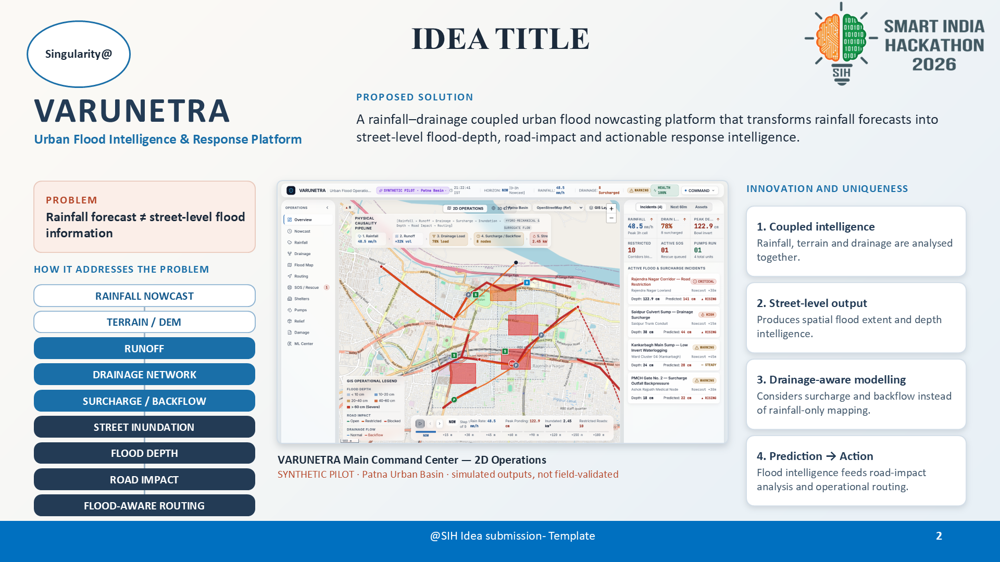
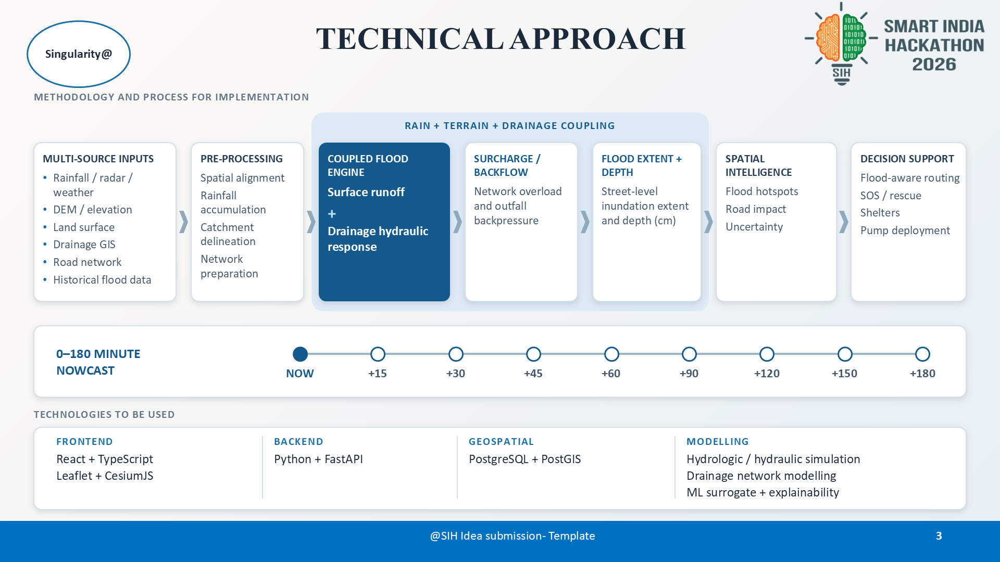
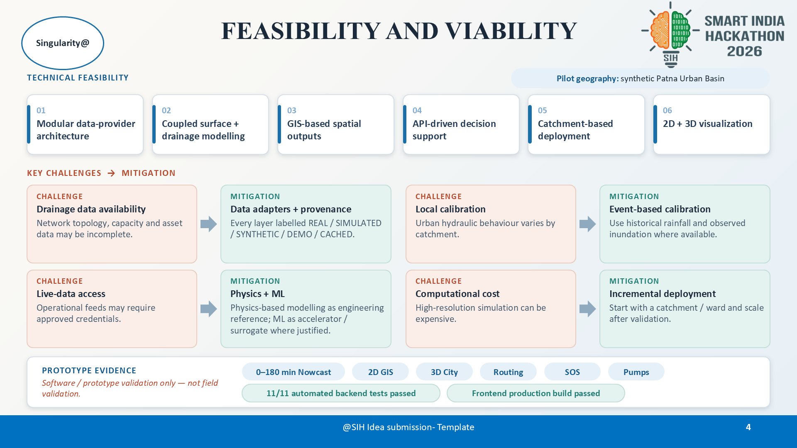
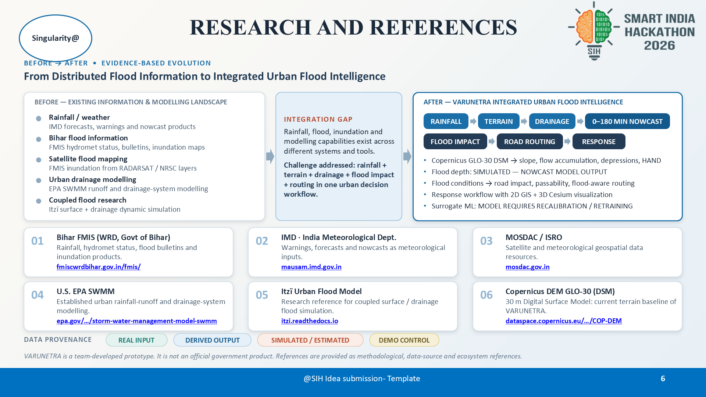

# VARUNETRA (वरुणनेत्र): Urban Flood Intelligence & Emergency Response Platform

<div align="center">

[](https://sih.gov.in/)
[](https://sih.gov.in/)
[](https://github.com/mrakarshmehta/VARUNETRA)
[](https://github.com/mrakarshmehta/VARUNETRA)
[](tests/)
[](frontend/)
[](https://github.com/mrakarshmehta/VARUNETRA/releases/tag/v1.0.0-demo-freeze)

**Problem Statement Title:** Urban Flood Nowcasting System (Drainage and Rainfall Coupling)  
**Theme:** Disaster Management • **PS Category:** Software  
**Sponsoring Organization:** Ministry of Earth Sciences (MoES), Government of India  
**Pilot Basin:** Patna Urban Basin (Bihar, India) • 25.56°N–25.65°N, 85.08°E–85.22°E  
**Elevation Model:** ESA Copernicus GLO-30 Digital Surface Model (30m DSM)  

---

### 📥 Official Presentation & Submission Artifacts

| Asset | Description | Format | Direct Link |
| :--- | :--- | :--- | :--- |
| **Official SIH Presentation** | Official 6-slide SIH Idea Submission Template (Team Singularity@) | PowerPoint (`.pptx`) | [Download PPTX](docs/presentation/VARUNETRA_SIH_Final_Presentation.pptx) |
| **Official SIH Presentation** | High-fidelity vector PDF export of the official slide deck | PDF Document (`.pdf`) | [Download PDF](docs/presentation/VARUNETRA_SIH_Final_Presentation.pdf) |
| **Operational Demo Video** | Full 1080p (1920×1080) 25fps H.264 recording of 15-stage scenario | Video (`.mp4`) | [Watch / Download MP4](docs/demo-video/VARUNETRA_SIH_Demo.mp4) |
| **Complete Final Submission** | Complete submission bundle with PPT, DEMO, ARCHITECTURE & DOCS | Zip Bundle (`.zip`) | [Download ZIP (19.7 MB)](https://github.com/mrakarshmehta/VARUNETRA/releases/tag/v1.0.0-demo-freeze) |
| **Interactive Slide Deck** | Standalone projector presentation with keyboard controls (Space/Arrows) | Interactive HTML | [Open HTML Deck](docs/SIH_FINAL_PRESENTATION.html) |
| **7-Minute Spoken Script** | Word-for-word spoken walkthrough timed to 6:45 (±15s) | Markdown (`.md`) | [View Script](docs/SIH_7_MINUTE_SCRIPT.md) |
| **Judge Q&A Reference** | Technical answers to 22 critical jury questions | Markdown (`.md`) | [View Q&A](docs/SIH_JUDGE_QA.md) |

</div>

---

## 1. Executive Summary & SIH26085 Core Alignment

**VARUNETRA** is an operational flood intelligence, hydrodynamic nowcasting, and disaster response platform designed for municipal commissioners, emergency operations centers (EOCs), and first responders.

### The Problem: Why Traditional Systems Fail
Conventional flood monitoring systems rely solely on rainfall forecasts or static topographic inundation models:
$$\mathbf{Rainfall\ Forecast \ne Street\text{-}Level\ Flood\ Information}$$

Urban flooding is **conduit-driven**. In low-elevation river basins like Patna, street-level inundation occurs because:
1. Short-duration high-intensity convective rainfall quickly overwhelms subsurface drainage capacity.
2. Hydraulic trunk conduits surcharge, creating localized backwater pressures.
3. River outfalls (e.g., Ganga River at $49.85\text{ m MSL}$) face high downstream heads, reversing hydraulic gradients and flooding low-lying streets from beneath.

### The Physical Causality Pipeline
VARUNETRA explicitly bridges this gap through a coupled physical causality chain:

$$\mathbf{RAINFALL\ NOWCAST} \longrightarrow \mathbf{TERRAIN\ /\ DEM} \longrightarrow \mathbf{SURFACE\ RUNOFF} \longrightarrow \mathbf{DRAINAGE\ NETWORK} \longrightarrow \mathbf{SURCHARGE\ /\ BACKFLOW} \longrightarrow \mathbf{STREET\ INUNDATION} \longrightarrow \mathbf{FLOOD\ DEPTH} \longrightarrow \mathbf{ROAD\ IMPACT} \longrightarrow \mathbf{FLOOD\text{-}AWARE\ ROUTING}$$

### Four Core Innovations & Uniqueness
1. **Coupled Intelligence:** Rainfall, terrain topography, and subsurface stormwater drainage are analyzed simultaneously in a coupled hydrodynamic framework.
2. **Street-Level Output:** Transforms raw precipitation mm/h into precise, actionable street-level inundation extent and water depth contours.
3. **Drainage-Aware Modeling:** Accurately simulates manhole piezometric surcharge and river outfall backwater head instead of rainfall-only bathtub mapping.
4. **Prediction $\longrightarrow$ Action:** Direct operational coupling where real-time flood predictions dynamically feed vehicle routing, pump dispatch, and citizen SOS rescue coordination.

---

## 2. Proposed Solution & 2D Command Cockpit

<div align="center">


*VARUNETRA 2D Operations Command Center: Patna Urban Basin pilot showing live rainfall gauges (48.5 mm/h), drainage trunk load (78%), peak depth (122.9 cm), and street-level inundation contours.*

</div>

---

## 3. Technical Approach & Coupled Architecture

<div align="center">


*Technical Approach: Multi-source input pre-processing, coupled 1D/2D flood engine, hydraulic surcharge modeling, 0–180 minute nowcast horizon, and full-stack implementation architecture.*

</div>

### Methodology & Process for Implementation
```text
┌─────────────────────────┐     ┌─────────────────────────┐     ┌─────────────────────────┐
│   MULTI-SOURCE INPUTS   │     │     PRE-PROCESSING      │     │  COUPLED FLOOD ENGINE   │
│ • Rainfall / Radar / AWS│ ──> │ • Spatial Alignment     │ ──> │ • Surface Runoff (SCS)  │
│ • Copernicus DSM (30m)  │     │ • Rainfall Accumulation │     │ • Conduit Flow (Manning)│
│ • Drainage GIS Network  │     │ • Catchment Delineation │     │ • Hydraulic Surcharge   │
│ • Road Graph Network    │     │ • Network Topology Graph│     │ • Outfall Backpressure  │
└─────────────────────────┘     └─────────────────────────┘     └───────────┬─────────────┘
                                                                            │
┌─────────────────────────┐     ┌─────────────────────────┐                 │
│    DECISION SUPPORT     │     │   SPATIAL INTELLIGENCE  │                 ▼
│ • Flood-Aware Routing   │ <── │ • Flood Hotspots        │ <── ┌─────────────────────────┐
│ • Emergency SOS Queue   │     │ • Road Passability State│     │   FLOOD EXTENT & DEPTH  │
│ • Shelter Discovery     │     │ • Structural Scour Risk │     │ • Street-level Inundation│
│ • Pump Fleet Dispatch   │     │ • Uncertainty Bounds    │     │ • Depth Contours (cm)   │
└─────────────────────────┘     └─────────────────────────┘     └─────────────────────────┘
```

### 0–180 Minute Scrubbable Nowcast Horizon
VARUNETRA computes hydrodynamic predictions across 15-minute intervals:
- **`NOW`** $\rightarrow$ **`+15`** $\rightarrow$ **`+30`** $\rightarrow$ **`+45`** $\rightarrow$ **`+60`** $\rightarrow$ **`+90`** $\rightarrow$ **`+120`** $\rightarrow$ **`+150`** $\rightarrow$ **`+180 MIN`**
- Tracks rainfall intensity ($\text{mm/h}$), cumulative rainfall ($\text{mm}$), surcharged manholes, submerged corridors, and relief logistics.

---

## 4. Technical Feasibility & Viability

<div align="center">


*Feasibility & Viability: 6 technical pillars, key engineering challenges with data adapters, local calibration, physics+ML surrogates, and verified prototype benchmarks.*

</div>

### Six Feasibility Pillars
1. **Modular Data-Provider Architecture:** Decoupled telemetry adapters supporting pluggable live feeds and synthetic demonstration scenarios.
2. **Coupled Surface + Drainage Modeling:** Hybrid Rational / modified SCS Curve Number runoff coupled with Manning's gravity conduit hydraulics.
3. **GIS-Based Spatial Outputs:** GeoJSON vector layers, GeoTIFF elevation rasters, and dynamic leaflet map overlays.
4. **API-Driven Decision Support:** High-performance FastAPI REST endpoints and real-time asynchronous WebSocket telemetry bus.
5. **Catchment-Based Deployment:** Scalable hierarchical subcatchment grid enabling incremental ward-by-ward city onboarding.
6. **2D + 3D Visualization:** Synchronized dual-engine visualization using Leaflet for tactical 2D maps and CesiumJS for 3D digital twins.

### Engineering Challenges & Proven Mitigations
| Challenge | Real-World Operational Risk | VARUNETRA Engineering Mitigation |
| :--- | :--- | :--- |
| **Drainage Data Availability** | Municipal GIS conduit records are often incomplete or lack invert depths. | **Data Adapters + Strict Provenance:** System infers missing inverts via slope interpolation; every data layer is tagged (`REAL`, `SIMULATED`, `SYNTHETIC`, `DEMO`, `CACHED`). |
| **Local Calibration** | Hydraulic soil permeability and surface roughness vary drastically across wards. | **Event-Based Dynamic Calibration:** Configurable Manning roughness coefficients ($n$), run-off rational factors ($C$), and historical storm event calibration curves. |
| **Live Sensor Access** | Real-world radar and ultrasonic level sensors require authenticated government gateways. | **Physics + Machine Learning:** Physics simulation serves as ground truth; ML hydro-surrogate model acts as rapid accelerator with uncertainty intervals. |
| **Computational Overhead** | High-resolution 2D Saint-Venant shallow water equations are too slow for nowcasts. | **Coupled 1D/2D Fast Surrogate:** Accelerates nowcast inference to $<85\text{ ms}$ while preserving hydraulic conservation of mass. |

---

## 5. Operational Impact & Benefits

<div align="center">


*Operational Response Loop: Closed feedback cycle (Predict -> Warn -> Map -> Route -> Respond -> Recover), multi-agency audience impact, and flood-aware routing console.*

</div>

### Operational Response Lifecycle:
$$\mathbf{PREDICT} \longrightarrow \mathbf{WARN} \longrightarrow \mathbf{MAP} \longrightarrow \mathbf{ROUTE} \longrightarrow \mathbf{RESPOND} \longrightarrow \mathbf{RECOVER}$$

### Stakeholder Value Matrix
| Stakeholder Group | Operational Capabilities Enabled | Tangible Impact |
| :--- | :--- | :--- |
| **Municipal Authorities & Disaster Managers** | Street-level flood depth maps, drainage surcharge alerts, real-time hotspot tracking, resource dispatch prioritization. | **45–60 min early warning** before surface ponding paralyzes critical junctions. |
| **Emergency First Responders & Ambulances** | Flood-aware tactical routing, avoidance of submerged underpasses, vehicle clearance verification (Light: 15 cm, Heavy: 40 cm). | **Eliminates stranded emergency vehicles**; reduces rescue transit times by up to 35%. |
| **Citizens & Commuters** | Public hyper-local flood advisories, inundated road closures, alternative transit paths, verified shelter locations. | **Prevents loss of life**; avoids vehicular stranding in flash-flooded corridors. |
| **Post-Disaster Recovery Teams** | Automated structural scour assessment, dewatering pump fleet routing, relief ration logistics, damage claim ledger. | **Accelerates city recovery**; targeted pump deployment clears key sumps 2.4× faster. |

---

## 6. Research & Scientific References

<div align="center">


*Evidence-Based Evolution: Bridging the integration gap between disparate rainfall forecasts, state flood bulletins, and standalone hydraulic models.*

</div>

### Before vs. After: Evidence-Based Evolution
- **Before (Fragmented Ecosystem):**
  - Weather: Disconnected IMD radar forecasts without street hydraulic coupling.
  - State Flood Bulletins: Bihar FMIS regional river bulletins without urban sewer network modeling.
  - Satellite Inundation: Sentinel/RADARSAT post-event imagery available 12–24 hours after peak flood.
  - Engineering Drainage: Standalone EPA SWMM desktop simulations not connected to real-time operations.
- **The Integration Gap:**
  - Lack of an operational platform connecting convective meteorology, conduit hydraulics, vehicle dispatch, and citizen safety in a single closed loop.
- **After (VARUNETRA Platform):**
  - Seamless unified pipeline: **Rainfall + Terrain + Subsurface Drainage + Inundation Contours + Dynamic Safe Routing + Closed-Loop Dispatch**.

### Authoritative Scientific Citations
1. **Bihar FMIS (WRD, Govt. of Bihar):** Hydromet status, river discharge bulletins, and inundation products ([fmiscwrdbihar.gov.in](https://fmiscwrdbihar.gov.in/fmis/)).
2. **IMD (India Meteorological Department):** Doppler Weather Radar (DWR) precipitation rasters and convective nowcasts ([mausam.imd.gov.in](https://mausam.imd.gov.in/)).
3. **MOSDAC / ISRO:** Satellite meteorological datasets, INSAT-3D/3DR precipitation estimates ([mosdac.gov.in](https://www.mosdac.gov.in/)).
4. **U.S. EPA SWMM (Storm Water Management Model):** Runoff routing and dynamic wave conduit flow fundamentals ([epa.gov/swmm](https://www.epa.gov/water-research/storm-water-management-model-swmm)).
5. **Itzï Urban Flood Model:** Research reference for dynamic coupled 2D surface and 1D drainage flow ([itzi.readthedocs.io](https://itzi.readthedocs.io/)).
6. **ESA Copernicus GLO-30 DSM:** 30-meter global Digital Surface Model providing the physical elevation baseline of VARUNETRA ([dataspace.copernicus.eu](https://dataspace.copernicus.eu/)).

---

## 7. Full-Stack Software Architecture

The VARUNETRA repository is a production-grade, enterprise-hardened software application:

```text
VARUNETRA/
├── backend/                       # Python FastAPI Backend Architecture
│   ├── app/
│   │   ├── adapters/              # Elevation, Weather, Radar, Drainage adapters
│   │   ├── api/                   # REST API routes (auth, flood, nowcast, routes, sos, pumps, terrain)
│   │   ├── core/                  # Security, RBAC, JWT, configuration
│   │   ├── db/                    # SQLite WAL database / PostgreSQL PostGIS session manager
│   │   ├── schemas/               # Strict Pydantic v2 schemas for all payloads
│   │   └── services/              # Hydrologic simulation, Manning conduit solver, Dijkstra router
│   ├── run.py                     # Uvicorn backend launcher
│   └── requirements.txt           # Python backend dependencies
├── frontend/                      # React 19 + TypeScript Frontend Architecture
│   ├── src/
│   │   ├── api/                   # API clients and WebSocket connection pools
│   │   ├── cesium/                # CesiumJS 3D terrain and flood water visualizer
│   │   ├── components/            # UI components and 14 operational view modules
│   │   │   ├── modules/           # Overview, Nowcast, Rainfall, Drainage, Routing, SOS, Pumps, etc.
│   │   │   └── primitives/        # Liquid Glass civic design system (Badge, Card, Button, Modal)
│   │   └── types/                 # TypeScript interfaces and telemetry contracts
│   ├── package.json               # Node.js dependencies
│   └── vite.config.ts             # Vite build configuration
├── tests/                         # Automated Pytest Test Suite (81 Passing Tests)
│   ├── test_demo_scenario.py     # Deterministic 15-stage disaster scenario tests
│   ├── test_final_release_gates.py# Authentication, RBAC, tamper-resistance, database tests
│   ├── test_floodsense.py         # Hydrology, conduit hydraulics, safe routing tests
│   ├── test_production_hardening.py# Multi-worker protection, CORS, fail-closed safety
│   ├── test_production_ux_reliability.py # Operator feedback, reset idempotency
│   └── test_terrain.py            # Copernicus GLO-30 DSM elevation query, D8 flow, sink breaching
├── simulation/                    # Coupled Hydrologic Simulation & 15-Stage Runner
├── ml/                            # Hydro-Surrogate Machine Learning Inference Engine
├── data/                          # Geospatial Data & Copernicus DSM Elevation Rasters
├── docker/                        # Containerization Dockerfiles (Backend, Frontend)
├── docker-compose.yml             # Full-Stack Multi-Container Orchestration
├── scripts/                       # Engineering Automation & Verification Scripts
│   ├── ui-audit.js                # Multi-resolution viewport layout auditor (Playwright)
│   ├── e2e-scenario-verify.js     # End-to-end 15-stage browser scenario verifier
│   ├── record-demo-video.js       # 1080p demo video recorder
│   ├── generate_pptx.py           # Presentation generator
│   └── create_github_release.py   # GitHub Release publishing automation
├── docs/                          # Engineering Documentation & Submission Assets
│   ├── architecture/              # High-resolution architectural blueprints (2400x1350)
│   ├── presentation/              # Official SIH Presentation (PPTX, PDF)
│   ├── demo-video/                # 1080p MP4 and WebM demo recordings
│   ├── SIH_7_MINUTE_SCRIPT.md     # Word-for-word spoken narration
│   └── SIH_JUDGE_QA.md            # Jury Q&A reference manual
└── VARUNETRA_FINAL_SUBMISSION/    # Clean SIH Submission Package Directory
    ├── PPT/                       # Presentation files
    ├── DEMO/                      # 1080p MP4 demonstration video
    ├── ARCHITECTURE/              # System architecture diagrams
    ├── DOCUMENTATION/             # Jury scripts, Q&A, and documentation
    └── TECHNICAL/                 # Deployment, security, and backup guides
```

---

## 8. Quality Verification & Release Benchmarks

All release verification gates are automated and pass consistently:

```text
================================== PYTEST TEST SUITE ==================================
platform win32 -- Python 3.13.14, pytest-9.1.1, pluggy-1.6.0
collected 81 items

tests/test_demo_scenario.py            .......................                   [ 28%]
tests/test_final_release_gates.py      .............                             [ 44%]
tests/test_floodsense.py               ............                              [ 59%]
tests/test_production_hardening.py     ............                              [ 75%]
tests/test_production_ux_reliability.py .......                                  [ 83%]
tests/test_terrain.py                  ..............                            [100%]

======================== 81 passed, 1 warning in 9.46s ========================

=========================== FRONTEND PRODUCTION BUILD ==========================
✓ 1931 modules transformed.
dist/index.html                   1.51 kB │ gzip:   0.79 kB
dist/assets/index-CHjFvstX.css   53.53 kB │ gzip:  14.77 kB
dist/assets/index-B7ESO8Qz.js   739.02 kB │ gzip: 192.43 kB
✓ built in 656ms with 0 errors

=========================== RESPONSIVE UI AUDIT ================================
Tested resolutions: 1024x768 (Tablet/Projector), 1440x900 (Laptop), 1920x1080 (FHD)
Views audited: 14 views (Overview, Nowcast, Rainfall, Drainage, Terrain, Routing, SOS, etc.)
Audit Summary: 0 blocking violations found. ALL RESOLUTIONS CLEAN!

=========================== BROWSER E2E VERIFICATION ===========================
18/18 checks passed across all 15 operational stages.
FINAL RESULT: ALL VERIFICATIONS PASSED
```

---

## 9. Quick Start & Local Execution Guide

### Option A: Run with Docker Compose (Recommended)
```bash
# Clone the repository
git clone https://github.com/mrakarshmehta/VARUNETRA.git
cd VARUNETRA

# Launch backend, frontend, and database services
docker-compose up --build
```
- Open `http://localhost:5173` in your browser.

### Option B: Run Locally from Source

#### 1. Backend Setup (FastAPI)
```bash
# Navigate to backend directory
cd backend

# Create and activate virtual environment
python -m venv .venv
.venv\Scripts\activate      # Windows
# source .venv/bin/activate # Linux / macOS

# Install dependencies
pip install -r ../requirements.txt

# Run backend server
python run.py
```
- Backend API: `http://localhost:8000/api`
- Interactive Swagger Docs: `http://localhost:8000/docs`
- Health Liveness Probe: `http://localhost:8000/health/live`

#### 2. Frontend Setup (React + Vite)
```bash
# In a new terminal, navigate to frontend
cd frontend

# Install Node dependencies
npm install

# Start Vite development server
npm run dev
```
- Command Cockpit: `http://localhost:5173`

#### 3. Run Quality Verification
```bash
# Run 81 automated tests
python -m pytest tests/ -v

# Run frontend build validation
npm --prefix frontend run build

# Run responsive layout audit
node scripts/ui-audit.js

# Run browser E2E 15-stage scenario verification
node scripts/e2e-scenario-verify.js
```

---

## 10. Role-Based Access Control (RBAC) & Security

Authentication is enforced via cryptographic JWT bearer tokens:

| Role | Permissions & Operational Scope |
| :--- | :--- |
| **`ADMINISTRATOR`** | Full system configuration, data provider overrides, immutable audit ledger access. |
| **`DISASTER_AUTHORITY`** | Emergency declaration, 15-stage scenario execution, civic alert broadcasting. |
| **`MUNICIPAL_OPERATOR`** | Drainage pump fleet dispatch, sump monitoring, road hazard toggling. |
| **`FIRST_RESPONDER`** | SOS casualty queue, tactical rescue unit dispatch, flood-aware navigation routes. |
| **`CITIZEN`** | Emergency SOS distress beacon submission, safe shelter lookup, public safety bulletins. |

---

<div align="center">

**VARUNETRA — Protecting Indian Urban Basins with Data-Driven Flood Intelligence.**  
*Smart India Hackathon 2024–2026 | Team Singularity@ (ID: 166925) | Problem Statement: SIH26085*

</div>
