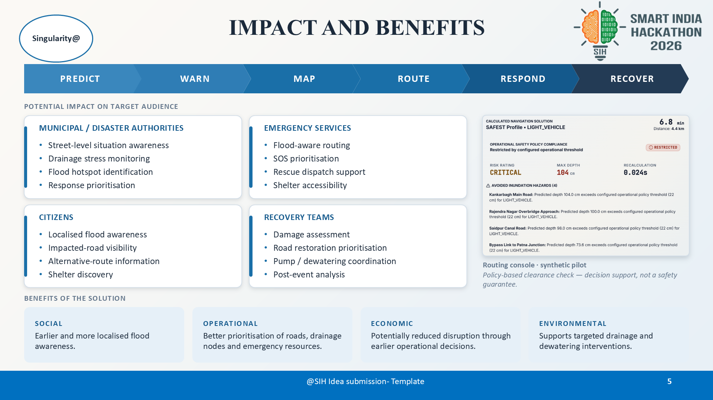
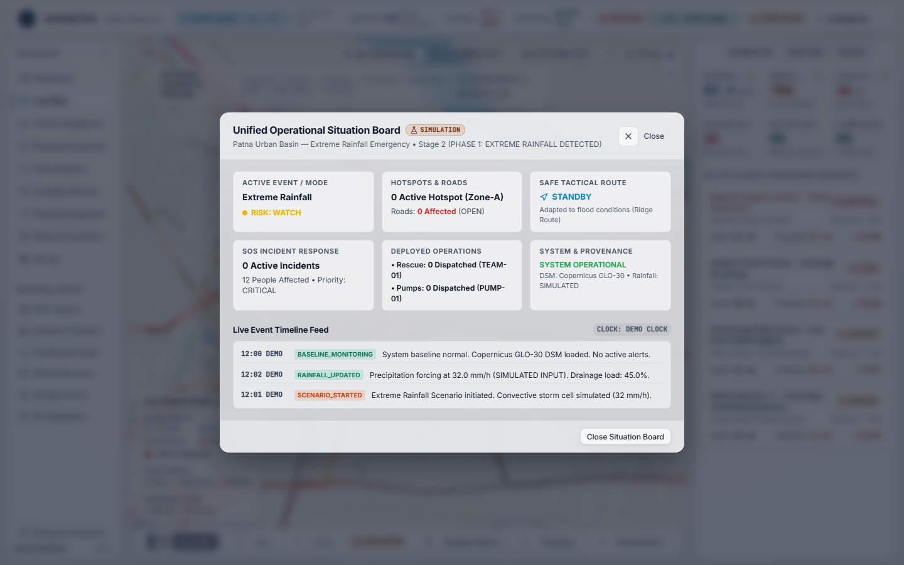

# VARUNETRA (वरुणनेत्र): Urban Flood Intelligence & Response Platform
**Smart India Hackathon 2024–2026 | Problem Statement: SIH26085**  
**Problem Statement Title:** Urban Flood Nowcasting System (Drainage and Rainfall Coupling)  
**Theme:** Disaster Management | **Category:** Software  
**Team ID:** `166925` | **Team Name:** `Singularity@`  
**Sponsoring Organization:** Ministry of Earth Sciences (MoES), Government of India  
**Pilot Basin:** Patna Urban Basin (Bihar, India) • 25.56°N–25.65°N, 85.08°E–85.22°E  
**Release Tag:** `v1.0.0-demo-freeze`

---

## 1. Executive Summary & SIH26085 Core Alignment

**VARUNETRA** is an operational flood intelligence, hydrodynamic nowcasting, and disaster response platform designed for municipal commissioners, emergency operations centers (EOCs), and first responders.

Unlike conventional hazard mapping tools that treat urban flooding as disconnected 2D water puddles on static terrain, VARUNETRA directly couples **short-burst convective precipitation hyetographs** with **subsurface stormwater conduit hydraulics (Manning flow)** to predict pipe surcharging, river outfall backwater head, and street-level inundation depths.

### The Physical Causality Loop:
$$\mathbf{RAINFALL} \longrightarrow \mathbf{RUNOFF} \longrightarrow \mathbf{DRAINAGE\ CONDUIT} \longrightarrow \mathbf{SURCHARGE\ /\ BACKFLOW} \longrightarrow \mathbf{STREET\ INUNDATION} \longrightarrow \mathbf{FLOOD\ DEPTH} \longrightarrow \mathbf{ROAD\ IMPACT} \longrightarrow \mathbf{SAFE\ ROUTING}$$

---

## 2. System Architecture & Data Flow

### Architecture Blueprint


### End-to-End Data Transformation


### Closed-Loop Operational Response


---

## 3. SIH Final Presentation & Jury Resources

All technical presentation assets, word-for-word spoken scripts, jury Q&A reference manuals, and video demonstrations are prepared for evaluation:

| Asset | Description | Format |
| :--- | :--- | :--- |
| [SIH Presentation PPTX](VARUNETRA_FINAL_SUBMISSION/PPT/VARUNETRA_SIH_Final_Presentation.pptx) | Official 10-slide presentation (16:9 widescreen, fully editable) | PowerPoint (.pptx) |
| [SIH Presentation PDF](VARUNETRA_FINAL_SUBMISSION/PPT/VARUNETRA_SIH_Final_Presentation.pdf) | Official 10-slide PDF export for projector & print display | Document (.pdf) |
| [Scenario Demo Video (MP4)](VARUNETRA_FINAL_SUBMISSION/DEMO/VARUNETRA_SIH_Demo.mp4) | High-definition 1080p screen recording of the 15-stage disaster scenario | Video (1080p H.264 MP4) |
| [SIH Final 10-Slide Deck](docs/SIH_FINAL_10_SLIDE_PRESENTATION.md) | Official 10-slide story covering problem, solution, science, demo, impact, boundaries, and roadmap | Markdown |
| [Interactive Projector Deck](docs/SIH_FINAL_PRESENTATION.html) | Standalone browser presentation with keyboard slide controls (Left/Right/Space/F) | Interactive HTML |
| [7-Minute Speaking Script](docs/SIH_7_MINUTE_SCRIPT.md) | Word-for-word spoken narration timed to exactly 6:45 (±15s) with stage cues | Markdown |
| [Technical Jury Q&A Guide](docs/SIH_JUDGE_QA.md) | Authoritative 30–45 second answers to 22 critical questions | Markdown |
| [Demo Scenario Cheat Sheet](docs/SIH_DEMO_CHEAT_SHEET.md) | Stage-by-stage operator reference sheet for live jury walkthroughs | Markdown |

---

## 4. Key Capabilities & Module Matrix

### Core Scientific & Hydrologic Modules
1. **Coupled 1D/2D Hydrodynamics**:
   - Subcatchment surface runoff modeled via modified SCS Curve Number and Rational infiltration formulation ($Q = \frac{C \cdot I \cdot A}{360}$).
   - Subsurface gravity conduit conveyance solved with Manning’s pipe flow ($Q = \frac{1}{n} A R^{2/3} S^{1/2} \sqrt{1 - \beta}$).
2. **Hydraulic Surcharge & River Outfall Backflow**:
   - Piezometric hydraulic grade line (HGL) tracked at every manhole node relative to ground rim elevation.
   - Ganga River outfall backwater head ($H_{\text{river}} = 49.85\text{ m MSL}$) modeled to detect reverse hydraulic gradients that prevent gravity discharge.
3. **0–3 Hour High-Resolution Flood Nowcasting**:
   - Scrubbable 15-minute intervals: `NOW`, `+15`, `+30`, `+45`, `+60`, `+90`, `+120`, `+150`, `+180 MIN`.
   - Real-time tracking of rainfall rate (mm/h), accumulated rain (mm), surcharged manholes, active inundation area ($\text{km}^2$), and restricted corridors.
4. **Machine Learning Hydro-Surrogate Model**:
   - Accelerated inference ($<85\text{ ms}$) trained on coupled hydrodynamic simulation samples.
   - Quantile prediction intervals ($10\% - 90\%$) providing depth bounds and uncertainty metrics rather than false millimeter precision.
   - Explicitly flagged: `SURROGATE INFERENCE — RECALIBRATION REQUIRED FOR UNGAUGED BASINS`.
5. **Urban Terrain Intelligence Engine (Copernicus GLO-30 DSM)**:
   - Real 30-meter elevation raster (`Copernicus_DSM_COG_10_N25_00_E085_00_DEM.tif`, 44.7 MB).
   - Bilinear elevation queries, D8 flow direction, slope and aspect extraction, and sink breaching.
6. **Dynamic Flood-Aware Tactical Routing**:
   - Modified Dijkstra directed road graph pathfinding recalculating edge traversal costs based on predicted flood depth:
     $$W = L \cdot \left(1 + 10 \cdot \left(\frac{d}{d_{\text{max}}}\right)^2\right)$$
   - Vehicle mechanical clearance thresholds (Ambulances: 30 cm, Heavy Rescue Trucks: 50 cm).

### Tactical Incident Command Modules
1. **Interactive GIS Cockpit (2D & 3D)**:
   - 2D Leaflet operational map and Cesium 3D digital twin with water-depth contour overlays.
2. **Unified Operational Situation Board**:
   - High-priority event summary displaying flood risk, affected corridors, active SOS beacons, dispatched teams, pump states, and system health above the fold.
3. **Citizen SOS Dispatch**:
   - Geo-located emergency requests with casualty count, mobility tags (e.g. wheelchair assist), status tracking (`NEW` → `ASSIGNED` → `ON_SCENE` → `RESCUED`), and tactical boat squad assignment.
4. **Municipal Dewatering Pump Fleets**:
   - Telemetry and dispatch controls for mobile diesel dewatering pumps ($1,800\text{ m}^3/\text{h}$) to relieve surcharged sumps.
5. **Tamper-Evident ACID Audit Ledger**:
   - Immutable transaction logging for every command order, dispatch action, and parameter change.

---

## 5. End-to-End Operational Demo (15 Deterministic Stages)

VARUNETRA features a deterministic 15-stage disaster response lifecycle representing an extreme cloudburst over Patna Urban Basin:

```text
Phase 0: Baseline Monitoring
   [Stage 1]  System Normal • Dry baseline • Copernicus GLO-30 DSM loaded • All roads OPEN
Phase 1: Extreme Rainfall Detected
   [Stage 2]  Convective cell approaches • Simulated rainfall 32 mm/h • Nowcast triggers
   [Stage 3]  Rainfall intensifies to 54 mm/h • Infiltration saturation reached
   [Stage 4]  Peak precipitation 78 mm/h • Saidpur drainage trunk reaches 84% load
Phase 2: Flood Nowcast & Drainage Surcharge
   [Stage 5]  Surcharge threshold breached • Backpressure from Ganga River outfall
   [Stage 6]  Severe ponding reaches 48.5 cm • 8 manhole nodes overflowing
Phase 3: Hotspot Detection
   [Stage 7]  Micro-depression hotspots identified (Rajendra Nagar Lowland & Saidpur Culvert)
Phase 4: Road Impact & Safe Routing Decision
   [Stage 8]  Rajendra Nagar Corridor inundated (122.9 cm) • Road marked BLOCKED
   [Stage 9]  Flood-aware safe route computed • Responders diverted via Bailey Road (4.2 km, ETA 11 min)
Phase 5: Citizen SOS Ingestion
   [Stage 10] Emergency beacon SOS-01 ingested: 4 citizens trapped on ground floor (Medical urgency)
Phase 6: Rescue & Pump Fleet Orchestration
   [Stage 11] Rescue Team TEAM-01 dispatched with tactical navigation path
   [Stage 12] Municipal High-Flow Pump PUMP-01 (1800 m³/h) deployed to Bargawan Sump • Civic alert issued
Phase 7: Response & Recovery
   [Stage 13] Rain ceases • Dewatering pumps lower water levels below 15 cm • Roads reopen to CAUTION
   [Stage 14] Field officers log damage scour assessments (DAM-01, DAM-02)
Phase 8: Incident Resolved & Debrief
   [Stage 15] SOS resolved • Evacuees sheltered • Comprehensive debrief report generated
```

### Visual Evidence: Unified Situation Board


---

## 6. Scientific Provenance & Ethical Boundaries

VARUNETRA enforces strict provenance categorization across every API endpoint, model metric, and UI badge:

| VERIFIED (Production Hardened) | SIMULATED (Demonstration Build) | NOT CLAIMED (Ethical Boundaries) |
| :--- | :--- | :--- |
| • 81 backend pytest tests passing | • Convective rainfall input (32–88 mm/h) | • Real-world gauge/sensor field calibration |
| • 0 UI overflow violations across 1440/1920/1024 | • Citizen emergency SOS beacons | • Real-world ML model accuracy in ungauged basins |
| • Copernicus GLO-30 DSM 30m loaded | • Field rescue & pump status telemetry | • Certified civil engineering drain structural designs |
| • 18/18 Browser E2E checks verified | • Accelerated 15-stage presentation clock | • Direct government single sign-on (SSO) |
| • JWT Authentication + RBAC active | • Synthetic relief camp occupancy counts | • Live IMD Doppler radar direct API feed |
| • Fail-Closed REAL mode gate | | |

---

## 7. Quality & Verification Metrics

```text
Backend Test Suite (pytest):
  81 passed, 0 failed, 1 warning in 8.91s

Frontend Production Build (Vite + TypeScript):
  1931 modules transformed, 0 errors, built in 671ms

UI Layout & Overflow Audit:
  0 blocking violations across 1440x900, 1920x1080, and 1024x768 resolutions

Browser E2E Automation (Playwright):
  18/18 checks ALL PASS (baseline, start, nowcast, hotspots, roads, routing, SOS, rescue, pumps, alerts, recovery, completion, reset, replay, double-start, refresh-sync, presentation-mode)
```

---

## 8. Quickstart & Installation

### Prerequisites
- Python 3.11–3.13
- Node.js 18+ and npm
- GDAL / Rasterio compatible environment (included via pre-configured Python virtual environment)

### 1. Backend Setup
```bash
# Navigate to backend directory
cd backend

# Install dependencies (if not using pre-configured venv)
pip install -r ../requirements.txt

# Start backend server
python run.py
```
- API Base: `http://localhost:8000/api`
- OpenAPI Documentation: `http://localhost:8000/docs`
- Health Liveness: `http://localhost:8000/health/live`
- Health Readiness: `http://localhost:8000/health/ready`

### 2. Frontend Setup
```bash
# Navigate to frontend directory
cd frontend

# Install dependencies
npm install

# Start Vite development server
npm run dev
```
- Command Cockpit: `http://localhost:5173/`

### 3. Automated Verification Commands
```bash
# Run full backend test suite
python -m pytest tests/ -v

# Run frontend production build
cd frontend && npm run build && cd ..

# Run automated layout and overflow audit
node scripts/ui-audit.js

# Run full end-to-end browser scenario verification
node scripts/e2e-scenario-verify.js
```

---

## 9. Security & Role-Based Access Control (RBAC)

The application enforces strict Role-Based Access Control via cryptographic JWT bearer tokens:

- **`ADMINISTRATOR`**: Full system access, configuration overrides, audit ledger inspection.
- **`DISASTER_AUTHORITY`**: Emergency declaration, scenario management, civic alert broadcasts.
- **`MUNICIPAL_OPERATOR`**: Drainage pump dispatch, road closure management.
- **`FIRST_RESPONDER`**: SOS assignment, rescue unit dispatch, tactical route access.
- **`CITIZEN`**: SOS distress beacon submission, relief camp lookup, public advisories.

---
**VARUNETRA — Protecting Indian Cities with Data-Driven Flood Intelligence.**  
*Ministry of Earth Sciences (MoES) | Smart India Hackathon (SIH26085)*
